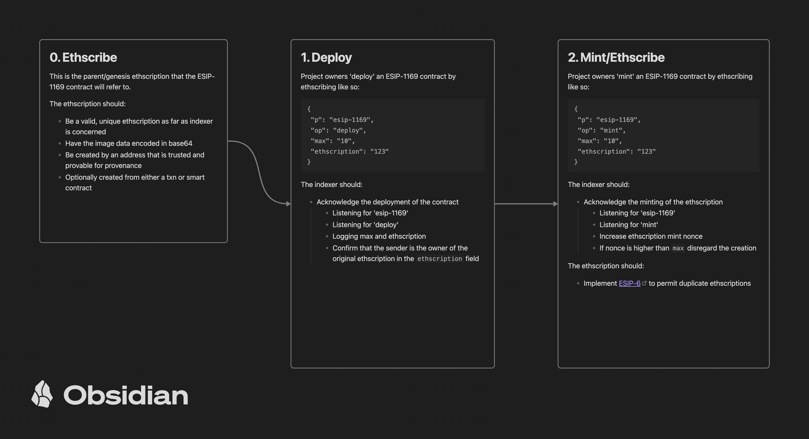

# esip-1169

ESIP-1169 is an ethscription protocol proposal for allowing 'editions', of a parent (genesis) ethscription to be 'minted'.

Ethscribing is expensive, so the content should only be ethscribed once, and the editions will simply point to the genesis ethscriptions txn data

An ESIP-1169 mint is an ethscribed JSON payload that needs to contain the `p: esip-1169` descriptor flag to signal to indexers that it should be treated as en esip-1169, or an edition.

A complete payload would look something like this:

```
{
  "p": "esip-1169", // descriptor indicator
  "op": "deploy", // 'op' code: deploy, mint, burn
  "abbrev"
  "max": "10",
  "ethscription": "123" // id of the genesis ethscription
}
```

## Lifecycle

1.  A genesis ethcription is created or referred to (any non-esip-1169 ethcription is valid)
2.  An ESIP-1169 contract is `deployed`

```
  {
    "p": "esip-1169",
    "op": "deploy",
    "max": "10",
    "ethscription": "123"
  }
```

3.  Editions can then be minted:

```
  {
    "p": "esip-1169",
    "op": "mint",
    "ethscription": "123"
  }
```

4. Ethscriptions are minted on a first come, first served basis, and then the {m}th `mint` is detected by indexers, and further `mint` operations with the matching ethscription id will be ignored and not honored

5. Burining WIP

```
  {
    "p": "esip-1169",
    "op": "burn",
    "nonce": 1,
    "ethscription": "123",
  }
```

# Diagram


